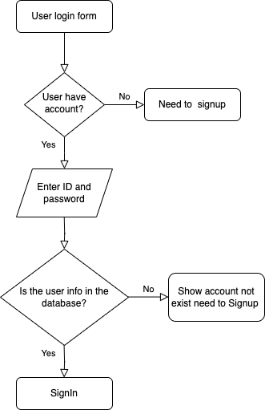
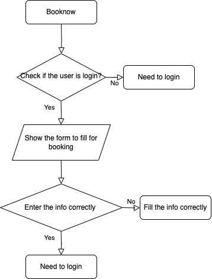

# DGL123-Project-Aran-Arora

## PHP Project

### Documentation:
#### Login Form

- The login form is used for flow to check if the user exists in the data. If not, then display that the account does not exist. Please Sign Up first.

    - In the place of the username, the user needs to enter their username, and in the support of the password, the user enters the password which connects with that user ID.
    - Then, the user-entered information will be sent to the database to check if the user ID and password exist. If they exist, then the users sign in; otherwise, display that the account does not exist; please Sign Up first. 

#### Sign Up Form

- The signup form checks flow if the user ID and email exist in the data. If not, send the data to the database and let the user Sign In.

    - In the place of the username input, the user needs to create their username, and in the password input, the user needs to make their password corresponding to their user ID. In the confirm password, the user confirms their password by re-entering it, and in the email input, the user enters their email.
    - Then, the user-entered information will be sent to the database to check if the user ID and email are unique. If they are unique, let the user Sign In and store the data in the database; otherwise, display the user ID and email already exist.

#### Book Now Button on the Ride page.
- The Book Now button is used for booking the electric scooter, but it checks whether the user logs in before showing the booking.

    - When the user clicks the book now button if the user has logged in, it displays the booking form; otherwise, it displays that the user needs to sign.
    - In the booking form, the user needs to fill the form correctly. If the user fills in correctly, the scooter will book. Otherwise, the form will display the error to fill in the info correctly.

### Milestone 1:
- I completed the first stage of the project, which involved developing the user interface (UI) by producing low-fidelity wireframes, in Milestone 1. These wireframes provide as a basic illustration of the project's appearance and functionality.

- Simple digital mockups that depict the user interface's overall flow, content arrangement, and structural structure are called low-fidelity wireframes. In order to concentrate entirely on the essential structure and functioning, they are purposefully kept basic and devoid of complex design feature and describe the way it works.

### Milestone 2:

- I've successfully developed the front end of the project, building upon the initial design concept outlined in Milestone 1 with several key enhancements. The user interface now offers a more refined and user-friendly design, incorporating improved visual elements to enhance the overall user experience. While the database connection is pending, I've completed the signup and login forms, ensuring a secure and seamless registration process. So, after database setup, users can sign up through the form to access electric scooters. The database still needs to be fully integrated. In milestone 3, it will process and securely collect user information. Users will log in and access electric scooter booking, with improved efficiency in fetching data from the database. This milestone is an important step forward in the project's journey toward its milestone 3, the high-quality state with a database connection.

### Milestone 3:

- In Milestone 3, a significant milestone has been reached in the project's development. The signup and login forms have been successfully connected, enhancing the user experience and security. Notably, we've implemented specific functions and conditions to ensure data integrity and user-friendly interactions.

User ID Restrictions: Users can now only enter a user ID that contains a combination of alphabets and numbers, improving data quality and security.

Unique Email and User ID: The system prevents the registration of accounts with duplicate email addresses or user IDs. This ensures the uniqueness of user credentials and enhances data integrity.

Password Validation: Password and password repeat fields have been implemented with validation checks. Users are prompted to enter their password twice to ensure accuracy, and the system verifies that the two entries match.

These additions not only enhance the security of user data but also contribute to a smoother and more reliable user experience. Milestone 3 represents a significant leap forward in the project's development, ensuring that user interactions are more secure and user-friendly while laying the groundwork for future database integration.

